<p align="center">
  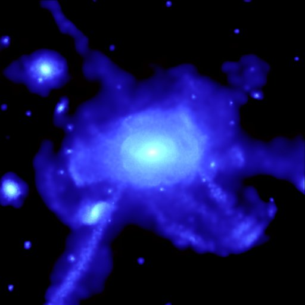
  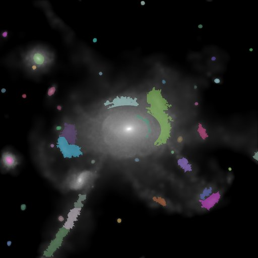
  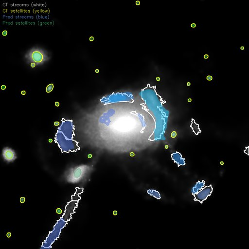
</p>

<h1 align="center">LSB-AI-Detection</h1>

<p align="center">
  <b>Automated detection of Low Surface Brightness features in astronomical images<br/>using fine-tuned SAM2 / SAM3 (Segment Anything Model)</b>
</p>

<p align="center">
  
  
  
  
</p>

---

Detects and segments **stellar streams** and **satellite galaxies** — the faintest structures around galaxies — from [FIREbox-DR1](https://fire.northwestern.edu/) cosmological simulation surface-brightness maps (FITS format). The pipeline covers everything from raw FITS preprocessing through noise-augmented training data generation to type-aware model evaluation.

<br/>

## Visual Overview

### Preprocessing Variants

Three preprocessing strategies convert raw surface-brightness (mag/arcsec²) FITS data into model-ready RGB images:

<table>
  <tr>
    <td align="center"><b>Asinh Stretch</b></td>
    <td align="center"><b>Linear Magnitude</b></td>
    <td align="center"><b>Multi-Exposure (3-ch)</b></td>
  </tr>
  <tr>
    <td>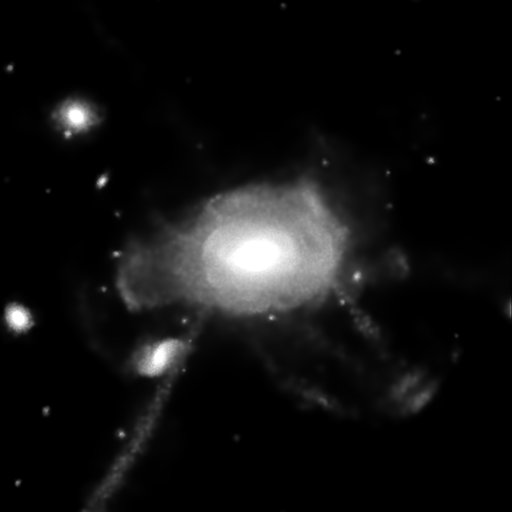</td>
    <td>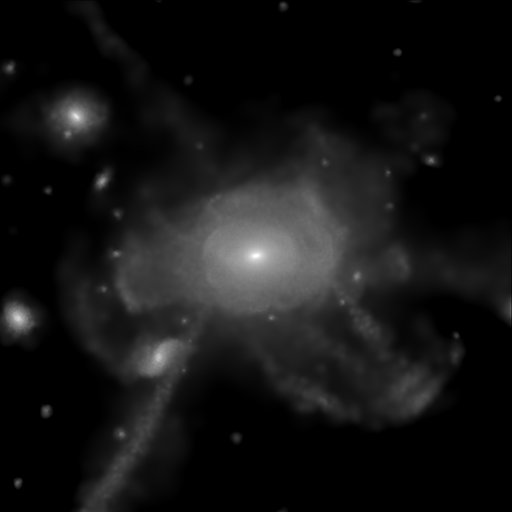</td>
    <td></td>
  </tr>
  <tr>
    <td>Nonlinear arcsinh mapping<br/>emphasizing faint features</td>
    <td>Linear mapping in magnitude<br/>space (global min/max)</td>
    <td>R=linear, G=asinh, B=gamma<br/>composite 3-channel</td>
  </tr>
</table>

### Ground Truth & Predictions

<table>
  <tr>
    <td align="center"><b>Ground Truth Instances</b></td>
    <td align="center"><b>SAM3 Evaluation Overlay</b></td>
  </tr>
  <tr>
    <td></td>
    <td></td>
  </tr>
  <tr>
    <td>Merged streams + satellites instance map<br/>Color-coded per-instance overlay on galaxy image</td>
    <td>GT contours (white=streams, yellow=satellites)<br/>Predictions (blue=streams, green=satellites)</td>
  </tr>
</table>

### Noise Robustness

Forward observation noise model simulates realistic observing conditions at different signal-to-noise ratios:

<table>
  <tr>
    <td align="center"><b>Clean (no noise)</b></td>
    <td align="center"><b>SNR ≈ 50</b></td>
    <td align="center"><b>SNR ≈ 20</b></td>
  </tr>
  <tr>
    <td></td>
    <td>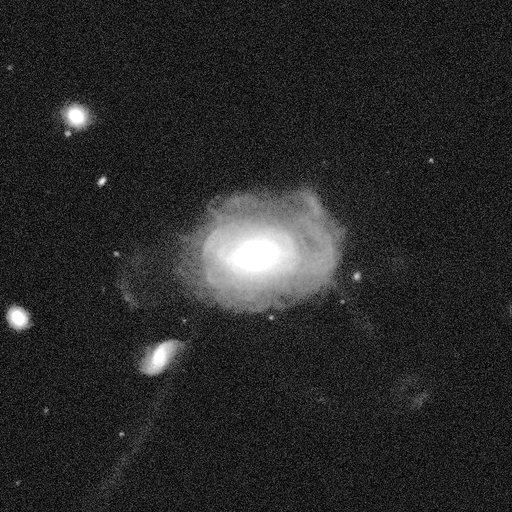</td>
    <td>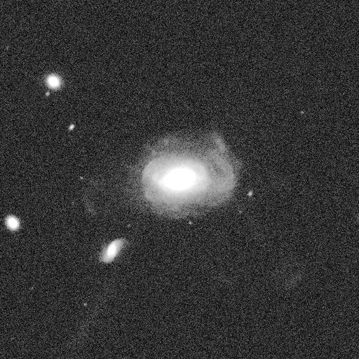</td>
  </tr>
  <tr>
    <td>Ideal simulation output</td>
    <td>Faint structures partially visible</td>
    <td>Only brightest features survive</td>
  </tr>
</table>

### SAM3 Dataset Visualization

4-column grid: **Original → Streams → Satellites → Combined** across preprocessing variants.

<p align="center">
  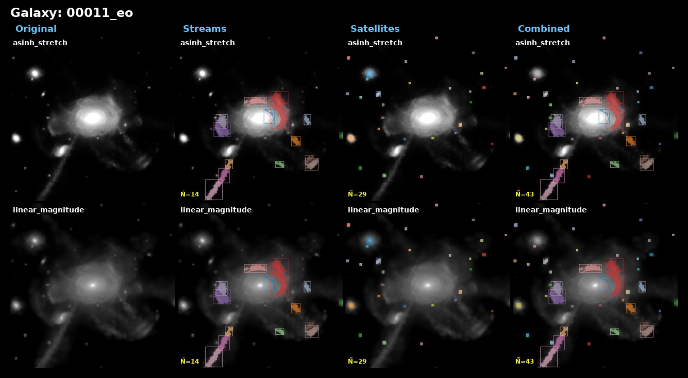
</p>

<details>
<summary>More examples</summary>

<p align="center">
  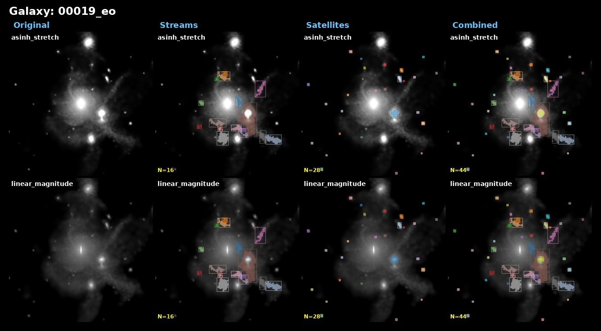
</p>

</details>

---

## Evaluation Results

### Metrics Across SNR Tiers

Performance degrades gracefully as noise increases. Clean images achieve Dice > 0.80, while SNR ≈ 5 remains challenging.

<table>
  <tr>
    <td align="center"><b>Combined Metrics by SNR</b></td>
    <td align="center"><b>Degradation Curves</b></td>
  </tr>
  <tr>
    <td>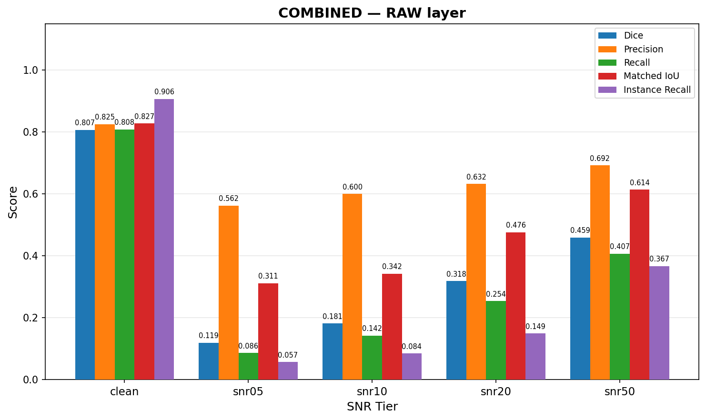</td>
    <td>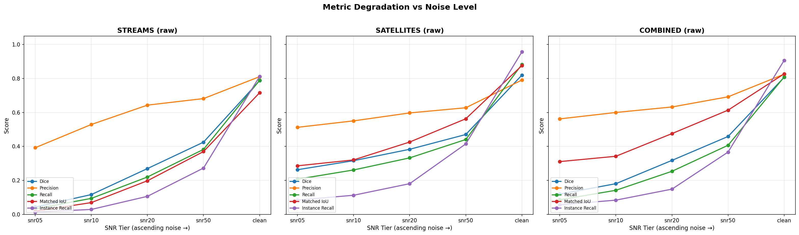</td>
  </tr>
</table>

### Mask Shape Statistics

Data-driven filter thresholds derived from ground truth geometry (streams vs satellites).

<p align="center">
  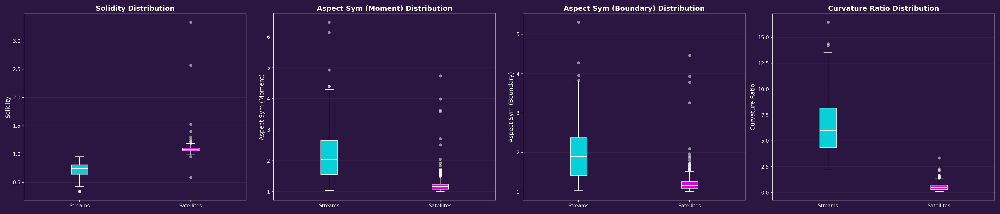
</p>

---

## Installation

```bash
git clone <repo-url> && cd LSB-AI-Detection

# Conda environment
conda create -n lsb python=3.12
conda activate lsb
pip install torch==2.7.0 torchvision torchaudio --index-url https://download.pytorch.org/whl/cu126
pip install -r requirements.txt

# SAM3 (install into same env)
git clone https://github.com/facebookresearch/sam3.git
cd sam3 && pip install -e ".[notebooks]" && cd ..

# SAM2 (install into same env)
git clone https://github.com/facebookresearch/sam2.git
cd sam2 && pip install -e ".[notebooks]" && cd ..

# (Optional) Versioned git hooks
git config core.hooksPath tools/githooks
```

| Category | Packages |
|----------|----------|
| Data | `numpy`, `astropy`, `opencv-python`, `pycocotools`, `Pillow`, `scikit-image` |
| DL | `torch>=2.0`, `torchvision>=0.15` |
| Config | `PyYAML`, `tqdm` |
| Viz | `matplotlib` |

---

## Quick Start

```bash
# 1. Full unified pipeline (Render → GT → Inference → Export)
python scripts/data/prepare_unified_dataset.py --config configs/unified_data_prep.yaml

# 2. Noise augmentation
python scripts/data/render_noisy_fits.py --config configs/unified_data_prep.yaml
python scripts/data/build_noise_augmented_annotations.py --config configs/unified_data_prep.yaml

# 3. Galaxy-level train/val split
python scripts/data/split_annotations.py --config configs/sam3_dataset_split.yaml

# 4. Evaluate
python scripts/eval/evaluate_sam3.py --config configs/eval_sam3.yaml
python scripts/eval/evaluate_sam2.py --config configs/eval_sam2.yaml
```

---

## End-to-End Pipeline

```
                    ┌─────────────────────────────────────────┐
                    │          FITS Surface-Brightness Maps    │
                    │         (FIREbox-DR1 Simulation Data)    │
                    └────────────────┬────────────────────────┘
                                     │
          ┌──────────────────────────┼──────────────────────────┐
          ▼                          ▼                          ▼
   ┌─────────────┐          ┌──────────────┐          ┌──────────────┐
   │ Phase 0     │          │ Phase 1      │          │ Phase 2      │
   │ Mask Stats  │          │ RENDER       │          │ GT           │
   │             │          │              │          │              │
   │ GT geometry │          │ FITS → RGB   │          │ SB masks →   │
   │ → filter    │          │ PNG images   │          │ instance     │
   │ thresholds  │          │ (per variant)│          │ maps (.npy)  │
   └─────┬───────┘          └──────┬───────┘          └──────┬───────┘
         │                         │                         │
         │            ┌────────────┴─────────────┐           │
         │            ▼                          ▼           │
         │   ┌────────────────┐       ┌────────────────┐     │
         │   │ Phase 3a       │       │ Phase 3b       │     │
         │   │ SAM2 AutoMask  │       │ SAM3 Prompts   │     │
         │   │                │       │                │     │
         └──►│ → Prior Filter │       │ → Type-Aware   │◄────┘
             │ → Core Excl.   │       │   Filter Fork  │
             │ → Group+Merge  │       │ → Streams/Sat  │
             └───────┬────────┘       └───────┬────────┘
                     │                        │
                     ▼                        ▼
              ┌─────────────┐         ┌──────────────┐
              │ Phase 4      │         │ Phase 4      │
              │ SAM2 Export  │         │ SAM3 Export  │
              │              │         │              │
              │ Symlinks     │         │ COCO JSON    │
              │ (img + gt)   │         │ + RLE masks  │
              └──────────────┘         └──────────────┘
                     │                        │
                     ▼                        ▼
              ┌──────────────────────────────────────┐
              │         Noise Augmentation            │
              │  Forward Observation Model (Poisson   │
              │  + readout noise) at SNR 5/10/20/50   │
              └──────────────┬───────────────────────┘
                             ▼
              ┌──────────────────────────────────────┐
              │   Galaxy-Level Train / Val Split      │
              └──────────────┬───────────────────────┘
                             ▼
              ┌──────────────────────────────────────┐
              │      Type-Aware Model Evaluation      │
              │  Dice · Precision · Recall · HD95     │
              │  Matched IoU · Instance Recall        │
              └──────────────────────────────────────┘
```

---

## Detailed Workflow

### Phase 0 — Mask Statistics (one-time)

Computes per-instance geometric statistics from canonical GT masks. Output drives all downstream filter thresholds.

```bash
python scripts/analysis/analyze_mask_stats.py \
    --gt_root data/02_processed/gt_canonical/current \
    --output_dir outputs/mask_stats
```

<details>
<summary>Output files & filter recommendations</summary>

| File | Content |
|------|---------|
| `mask_instance_stats.csv` | Per-instance: area, solidity, aspect ratios, curvature |
| `mask_stats_summary.json` | Quantile distributions + `filter_recommendations` |

```json
{
  "streams": {
    "min_area": 42, "max_area": 98304,
    "min_solidity": 0.12, "aspect_sym_moment_max": 8.5
  },
  "satellites": {
    "min_area": 15, "max_area": 5200,
    "min_solidity": 0.65, "aspect_sym_moment_max": 3.2
  }
}
```

Regenerate the distribution plots:

```bash
python scripts/analysis/plot_mask_stats.py
```

</details>

### Phases 1–4 — Unified Data Preparation

The main pipeline (`scripts/data/prepare_unified_dataset.py`) converts raw FITS data into training-ready datasets.

```bash
# Full pipeline (all 4 phases)
python scripts/data/prepare_unified_dataset.py --config configs/unified_data_prep.yaml

# Run individual phases
python scripts/data/prepare_unified_dataset.py --config configs/unified_data_prep.yaml --phase render
python scripts/data/prepare_unified_dataset.py --config configs/unified_data_prep.yaml --phase gt
python scripts/data/prepare_unified_dataset.py --config configs/unified_data_prep.yaml --phase inference
python scripts/data/prepare_unified_dataset.py --config configs/unified_data_prep.yaml --phase export

# Subset of galaxies
python scripts/data/prepare_unified_dataset.py --config configs/unified_data_prep.yaml --galaxies 11,13,19

# Force rebuild
python scripts/data/prepare_unified_dataset.py --config configs/unified_data_prep.yaml --force
```

| Phase | Action | Output |
|-------|--------|--------|
| **1 — Render** | FITS → RGB PNGs per preprocessing variant | `renders/current/{variant}/{galaxy_id}_{orient}/0000.png` |
| **2 — GT** | SB-threshold masks → instance maps | `gt_canonical/current/{base_key}/streams_instance_map.npy` |
| **3 — Inference** | SAM2 AutoMask or SAM3 text-prompt → filter → merge | `instance_map_uint8.png`, overlay, manifests |
| **4 — Export** | SAM2 symlinks + SAM3 COCO `annotations.json` | `sam2_prepared/`, `sam3_prepared/` |

### Noise Augmentation

Inject realistic observation noise using a forward model (SB → flux → counts → Poisson → readout → magnitude):

```bash
# Generate noisy FITS at multiple SNR tiers
python scripts/data/generate_noisy_fits.py --config configs/noise_profiles.yaml

# Render noisy FITS → PNG
python scripts/data/render_noisy_fits.py --config configs/unified_data_prep.yaml

# Build noise-augmented COCO annotations
python scripts/data/build_noise_augmented_annotations.py --config configs/unified_data_prep.yaml
```

### Train/Val Split

Galaxy-level splitting ensures no data leakage between train and validation:

```bash
python scripts/data/split_annotations.py --config configs/sam3_dataset_split.yaml
```

### Model Evaluation

Type-aware evaluation computing metrics independently for streams and satellites:

```bash
# SAM3 evaluation
python scripts/eval/evaluate_sam3.py --config configs/eval_sam3.yaml

# With overlays for visual inspection
python scripts/eval/evaluate_sam3.py --config configs/eval_sam3.yaml --save-overlays

# Per-galaxy aggregation
python scripts/eval/evaluate_sam3.py --config configs/eval_sam3.yaml --per-galaxy

# Noise-tier evaluation
python scripts/eval/evaluate_sam3.py --config configs/eval_sam3.yaml --snr-tag snr10

# Batch across all SNR tiers
bash scripts/eval/run_batch_eval.sh
```

---

## Visualization Scripts

| Script | Purpose | Output |
|--------|---------|--------|
| `visualize_sam3.py` | 4-column grid: Original / Streams / Satellites / Combined | `sam3_prepared/visualizations_grid/*.jpg` |
| `plot_mask_stats.py` | Streams vs satellites shape distribution boxplots | `outputs/mask_stats/*.png` |
| `visualize_eval_metrics.py` | Cross-SNR metric bars + degradation curves | `outputs/eval_sam3_comparison/*.png` |
| `overlay_masks_on_streams.py` | Overlay satellite masks on stream images | `sam2_prepared/overlays_satellites_on_streams/` |

```bash
# Generate all visualizations
python scripts/viz/visualize_sam3.py
python scripts/analysis/plot_mask_stats.py
python scripts/viz/visualize_eval_metrics.py \
    --results-dirs outputs/eval_sam3 outputs/eval_sam3_snr50 outputs/eval_sam3_snr20 \
                   outputs/eval_sam3_snr10 outputs/eval_sam3_snr05 \
    --labels clean snr50 snr20 snr10 snr05
```

---

## Evaluation Metrics

Two levels of metrics, reported for both **raw** (unfiltered) and **post** (filtered) prediction layers:

### Pixel-Level

| Metric | Formula | Empty-mask handling |
|--------|---------|---------------------|
| **Dice** | 2·TP / (2·TP + FP + FN) | `null` if both empty; `0.0` if one empty |
| **Precision** | TP / (TP + FP) | `null` if no predicted pixels |
| **Recall** | TP / (TP + FN) | `null` if no GT pixels |
| **Hausdorff95** | Symmetric 95th-percentile boundary distance | `null` if both empty; image diagonal if one empty |

### Instance-Level

| Metric | Description |
|--------|-------------|
| **Matched IoU** | Mean IoU of valid matches (Hungarian 1:1 on IoU matrix) |
| **Instance Recall** | Fraction of GT instances matched (IoU ≥ threshold) |

Aggregation: **Macro** (mean ± std across images) and **Micro** (global TP/FP/FN sums).

---

## Project Structure

```
LSB-AI-Detection/
├── configs/                            # YAML configuration files
│   ├── unified_data_prep.yaml          #   4-phase unified pipeline config
│   ├── eval_sam3.yaml                  #   SAM3 type-aware evaluation
│   ├── eval_sam2.yaml                  #   SAM2 evaluation
│   ├── noise_profiles.yaml             #   Forward noise model SNR profiles
│   └── sam3_dataset_split.yaml         #   Galaxy-level train/val split
│
├── scripts/                            # CLI entry points (by concern)
│   ├── MODULE_DOC.md                   #   Script I/O + schema notes
│   ├── data/                           #   Dataset build, noise FITS, splits
│   │   ├── prepare_unified_dataset.py  #     Main 4-phase pipeline
│   │   ├── generate_noisy_fits.py      #     Forward noise FITS
│   │   ├── render_noisy_fits.py        #     Noisy FITS → PNG
│   │   ├── build_noise_augmented_annotations.py
│   │   ├── split_annotations.py        #     Galaxy-level train/val split
│   │   ├── build_training_dataset.py   #     Merge / symlink COCO sources
│   │   └── generate_pnbody_fits.py     #     PNbody → VIS2 FITS
│   ├── eval/                           #   Model evaluation + local batch bash
│   │   ├── evaluate_sam3.py            #     SAM3 type-aware evaluation
│   │   ├── evaluate_sam2.py            #     SAM2 evaluation
│   │   ├── run_batch_eval*.sh          #     Batch eval wrappers
│   │   └── run_sweep_eval.sh           #     Checkpoint sweep (interactive / conda)
│   ├── cluster/                        #   Slurm + site-specific HPC launcher
│   │   ├── launch_eval_sweep.sh        #     sbatch wrapper (exports REPO_ROOT)
│   │   └── eval_sweep.slurm            #     Multi-tier SAM3 eval job body
│   ├── viz/                            #   Figures / QA grids
│   │   ├── visualize_sam3.py           #     4-column grid visualization
│   │   ├── visualize_eval_metrics.py   #     Cross-SNR metric charts
│   │   ├── visualize_sam2.py
│   │   └── overlay_masks_on_streams.py
│   └── analysis/                       #   Stats from masks / eval JSON
│       ├── analyze_mask_stats.py       #     GT instance statistics → thresholds
│       ├── plot_mask_stats.py          #     Shape metric boxplots
│       └── plot_recall_curve.py
│
├── src/                                # Python source package
│   ├── data/                           #   FITS I/O, preprocessing (asinh, linear, multi-exposure)
│   ├── noise/                          #   ForwardObservationModel (SB → flux → Poisson → readout)
│   ├── inference/                      #   SAM2 AutoMask runner, SAM3 text-prompt runner
│   ├── postprocess/                    #   Type-aware filtering pipeline
│   │   ├── satellite_prior_filter.py   #     Area/solidity/aspect rules
│   │   ├── streams_sanity_filter.py    #     Area bounds, edge-touch fraction
│   │   ├── core_exclusion_filter.py    #     Centroid radius exclusion
│   │   ├── candidate_grouping.py       #     Union-Find centroid clustering
│   │   └── representative_selection.py #     Best mask per group
│   ├── pipelines/unified_dataset/      #   Modular pipeline subpackage
│   ├── analysis/                       #   Per-mask geometry metrics
│   ├── evaluation/                     #   Pixel + instance metrics, SAM3 eval orchestration
│   ├── visualization/                  #   Overlay, grid, comparison plotting
│   └── utils/                          #   COCO RLE, logger, geometry helpers
│
├── data/
│   ├── 01_raw/                         # Raw FIREbox FITS + masks (symlinked)
│   └── 02_processed/                   # Pipeline outputs (renders, GT, exports)
│
├── tests/                              # Unit tests (pytest)
├── docs/                               # Documentation & assets
├── outputs/                            # Evaluation results & plots
├── notebooks/                          # Jupyter notebooks
├── requirements.txt
├── ARCHITECTURE.md                     # Detailed architecture docs
└── CHANGELOG.md                        # Version history
```

---

## Configuration Reference

### `configs/unified_data_prep.yaml`

<details>
<summary>Full config structure</summary>

```yaml
paths:
  firebox_root: "data/01_raw/LSB_and_Satellites/FIREbox-DR1"
  output_root: "data/02_processed"

data_selection:
  galaxy_ids: [11, 13, 19, ...]       # FIREbox galaxy IDs
  orientations: ["eo", "fo"]          # Edge-on, face-on
  canonical_sb_threshold: 32.0        # mag/arcsec² for GT masks

processing:
  target_size: [1024, 1024]

preprocessing_variants:
  - name: "asinh_stretch"
    params: { nonlinearity: 200.0, zeropoint: 22.5, clip_percentile: 99.5 }
  - name: "linear_magnitude"
    params: { global_mag_min: 20.0, global_mag_max: 35.0 }

inference_phase:
  engine: "sam2"                      # "sam2" or "sam3"
  input_image_variant: "linear_magnitude"
  sam3:
    checkpoint: "/path/to/sam3/checkpoint.pt"
    prompts:
      - { text: "stellar stream", type_label: "streams" }
      - { text: "satellite galaxy", type_label: "satellites" }

satellites:
  checkpoint: "/path/to/sam2/checkpoint.pt"
  generator:
    points_per_side: 64
    pred_iou_thresh: 0.65
    stability_score_thresh: 0.95
  prior:
    stats_json: "outputs/mask_stats/mask_stats_summary.json"
  core_exclusion:
    radius_frac: 0.08
```

</details>

### `configs/eval_sam3.yaml`

<details>
<summary>Evaluation config</summary>

```yaml
paths:
  render_dir: "data/02_processed/renders/current/asinh_stretch"
  gt_dir: "data/02_processed/gt_canonical/current"
  output_dir: "outputs/eval_sam3"

sam3:
  checkpoint: "/path/to/checkpoint.pt"
  bpe_path: "/path/to/bpe_simple_vocab_16e6.txt.gz"

prompts:
  - { text: "stellar stream", type_label: "streams", confidence_threshold: 0.55 }
  - { text: "satellite galaxy", type_label: "satellites", confidence_threshold: 0.45 }

match_iou_thresh: 0.5

post_filter:
  stats_json: "outputs/mask_stats/mask_stats_summary.json"
  edge_touch_frac: 0.8
```

</details>

### `configs/noise_profiles.yaml`

<details>
<summary>Noise model config</summary>

```yaml
paths:
  output_root: "data/04_noise"

noise_model:
  zeropoint: 22.5
  sky_level: 200
  read_noise: 5
  signal_quantile: 0.90
  background_quantile: 0.20

profiles:
  snr05: { target_snr: 5 }
  snr10: { target_snr: 10 }
  snr20: { target_snr: 20 }
  snr50: { target_snr: 50 }
```

</details>

---

## Data Layout

After running the full pipeline:

```
data/02_processed/
├── renders/current/                    # Phase 1 output
│   ├── asinh_stretch/{base_key}/0000.png
│   ├── linear_magnitude/{base_key}/0000.png
│   └── multi_exposure/{base_key}/0000.png
├── renders/noisy/                      # Noise-augmented renders
│   └── asinh_stretch/snr{05,10,20,50}/{base_key}/0000.png
├── gt_canonical/current/{base_key}/    # Phase 2+3 output
│   ├── streams_instance_map.npy        #   Streams-only GT
│   ├── instance_map_uint8.png          #   Merged streams + satellites
│   ├── instances.json                  #   Instance ID → type mapping
│   ├── manifest.json                   #   Provenance metadata
│   └── overlay.png                     #   QA visualization
├── sam2_prepared/                       # Phase 4: SAM2 export
│   ├── img_folder/{variant_key}/0000.png → (symlink)
│   └── gt_folder/{variant_key}/0000.png  → (symlink)
└── sam3_prepared/                       # Phase 4: SAM3 export
    ├── images/{variant_key}.png → (symlink)
    ├── annotations.json                #   COCO format with RLE masks
    └── visualizations_grid/            #   QA grid images
```

Where `{base_key}` = `{galaxy_id:05d}_{orientation}` (e.g. `00011_eo`).

---

## Module Documentation

Each source module has its own `MODULE_DOC.md` with detailed API docs:

| Module | Description | Docs |
|--------|-------------|------|
| `src/data/` | FITS I/O, preprocessing | [MODULE_DOC.md](src/data/MODULE_DOC.md) |
| `src/noise/` | Forward observation model | [MODULE_DOC.md](src/noise/MODULE_DOC.md) |
| `src/inference/` | SAM2/SAM3 inference runners | [MODULE_DOC.md](src/inference/MODULE_DOC.md) |
| `src/postprocess/` | Type-aware filter pipeline | [MODULE_DOC.md](src/postprocess/MODULE_DOC.md) |
| `src/pipelines/` | Unified dataset pipeline | [MODULE_DOC.md](src/pipelines/MODULE_DOC.md) |
| `src/analysis/` | Mask geometry metrics | [MODULE_DOC.md](src/analysis/MODULE_DOC.md) |
| `src/evaluation/` | Pixel + instance metrics | [MODULE_DOC.md](src/evaluation/MODULE_DOC.md) |
| `src/visualization/` | Overlay & QA plotting | [MODULE_DOC.md](src/visualization/MODULE_DOC.md) |
| `src/utils/` | COCO RLE, geometry, logger | [MODULE_DOC.md](src/utils/MODULE_DOC.md) |
| `scripts/` | CLI entry points | [MODULE_DOC.md](scripts/MODULE_DOC.md) |

---

## Acknowledgements

- **[FIREbox-DR1](https://fire.northwestern.edu/)** — Cosmological simulation data
- **[SAM2](https://github.com/facebookresearch/sam2)** / **[SAM3](https://github.com/facebookresearch/sam3)** — Segment Anything Model (Meta AI)
