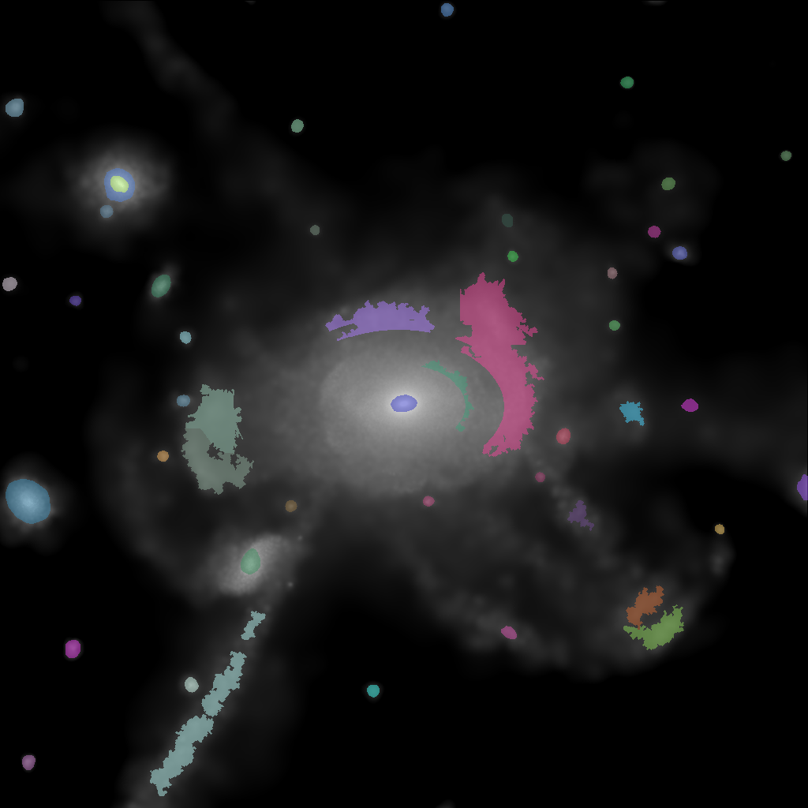
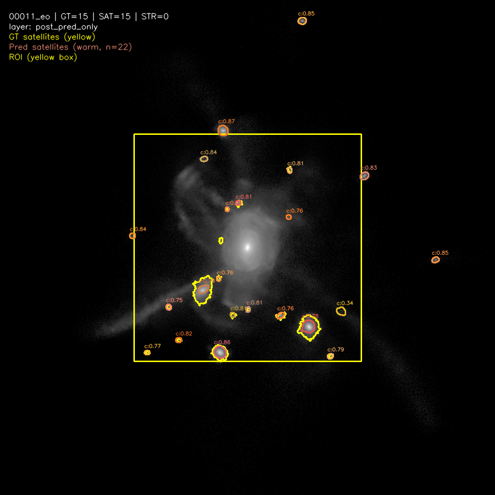

<p align="center">
  
</p>

<h1 align="center">LSB-AI-Detection</h1>

<p align="center">
  <b>Automated detection of Low Surface Brightness features in astronomical images<br/>using fine-tuned SAM3 (Segment Anything Model 3)</b>
</p>

<p align="center">
  
  
  
  
</p>

---

Detects and segments **tidal features** and **satellite galaxies** — the faintest structures around galaxies — from cosmological surface-brightness maps (FITS format). Sources include [FIREbox-DR1](https://fire.northwestern.edu/), the FIREbox Gold Satellites benchmark, and PNbody 24-line-of-sight renders.

> **Taxonomy.** The active dataset (`tidal_v1`) uses a **3-class** scheme: `tidal_features`, `satellites`, `inner_galaxy`. The `inner_galaxy` class is produced by the prior filter relabelling hard-center satellite candidates rather than dropping them. Legacy 2-class labels (`streams` / `satellites`) are aliased through `src/pipelines/unified_dataset/taxonomy.py`.

> **Model.** Only **SAM3** is supported — the legacy SAM2 stack was removed. The single evaluation entrypoint is `scripts/eval/evaluate_checkpoint.py` driven by `configs/eval_checkpoint.yaml`.

---

## Visual Overview

<table>
  <tr>
    <td align="center"><b>Ground Truth Instances</b></td>
    <td align="center"><b>SAM3 Evaluation Overlay (satellites)</b></td>
  </tr>
  <tr>
    <td></td>
    <td></td>
  </tr>
  <tr>
    <td>3-class instance overlay on galaxy <code>00011_eo</code><br/>(tidal features + satellites + inner galaxy)</td>
    <td><code>fbox_gold_satellites</code> · <code>post_pred_only</code> layer<br/>per-prediction contours with score / confidence labels</td>
  </tr>
</table>

---

## Satellite Diagnostics Taxonomy

On top of Hungarian-matched pixel and instance metrics, every raw satellite prediction is classified into one of four labels by `src/evaluation/satellite_diagnostics.py`. The classifier is **GT-driven** and uses no IoU threshold — it works from primary-GT match, purity (overlap / pred area), completeness (overlap / matched-GT area), and a one-to-one seed/GT ratio guard.

| Label | Meaning | Decision rule |
|---|---|---|
| `compact_complete` | Clean true-positive — prediction covers a single GT satellite well | one-to-one with `completeness ≥ complete_one_to_one_min_completeness` and `seed_gt_ratio ≤ complete_one_to_one_max_seed_ratio`, **or** `purity ≥ min_purity_for_match` and `completeness ≥ completeness_complete` |
| `diffuse_core`     | Pure but only covers the GT core (under-segmentation) | passes purity, fails the completeness threshold |
| `reject_low_purity`| Mixed coverage — most predicted pixels lie outside the matched GT | matched, but `purity < min_purity_for_match` |
| `reject_unmatched` | False positive — no GT overlap at all | `matched_gt_id is None` |

Per-sample rows are written to `sample_dir/diagnostics.json` and aggregated into `report.json["diagnostics_summary"]` (counts by label, plus quantile summaries of `purity` / `completeness` / `seed_gt_ratio` / `annulus_excess` / `radial_monotonicity`). `reject_host_background` is reserved for a Phase-2 host-support loader and is not emitted in Phase 1.

Enable in `configs/eval_checkpoint.yaml`:

```yaml
diagnostics:
  enabled: true
  satellites:
    min_purity_for_match: 0.5
    completeness_complete: 0.7
    complete_one_to_one_min_completeness: 0.6
    complete_one_to_one_max_seed_ratio: 1.5
    annulus_r_in_frac: 1.0
    annulus_r_out_frac: 1.5
    radial_n_rings: 4
```

---

## Quick Start

```bash
# 1. Build / refresh the unified tidal_v1 dataset
conda run --no-capture-output -n sam3 python scripts/data/prepare_unified_dataset.py \
    --config configs/unified_data_prep.yaml

# 2. Galaxy-level train/val split
python scripts/data/split_annotations.py --config configs/sam3_dataset_split.yaml

# 3. Evaluate a SAM3 checkpoint on one of three benchmarks
python scripts/eval/evaluate_checkpoint.py --config configs/eval_checkpoint.yaml
```

---

## End-to-End Pipeline

```
              ┌───────────────────────────────────────────┐
              │       FITS Surface-Brightness Maps         │
              │    (FIREbox-DR1 / Fbox-Gold / PNbody)      │
              └────────────────┬──────────────────────────┘
                               │
        ┌──────────────────────┼──────────────────────┐
        ▼                      ▼                      ▼
  ┌────────────┐      ┌────────────────┐      ┌────────────────┐
  │ Phase 1    │      │ Phase 2        │      │ Phase 0        │
  │ RENDER     │      │ GT (3-class)   │      │ Mask Stats     │
  │ FITS → RGB │      │ FIREbox SB31.5 │      │ → filter       │
  │  (variant) │      │ + instance map │      │   thresholds   │
  └─────┬──────┘      └───────┬────────┘      └────────┬───────┘
        │                     │                        │
        └────────┬────────────┘                        │
                 ▼                                     │
        ┌──────────────────┐                           │
        │ Phase 3          │◄──────────────────────────┘
        │ SAM3 Inference   │
        │   "satellite     │
        │    galaxy" prompt│
        │ → score gate     │
        │ → prior filter   │
        │   (relabel       │
        │    inner_galaxy) │
        └────────┬─────────┘
                 ▼
        ┌──────────────────┐
        │ Phase 4          │
        │ SAM3 Export      │
        │  COCO + RLE      │
        │  (3 classes)     │
        └────────┬─────────┘
                 ▼
        ┌────────────────────────────────────────┐
        │ Noise Augmentation                      │
        │  Forward observation model              │
        │  (Poisson + readout) at SNR 5/10/20/50  │
        └────────────────┬───────────────────────┘
                         ▼
        ┌────────────────────────────────────────┐
        │ Galaxy-Level Train / Val Split          │
        └────────────────┬───────────────────────┘
                         ▼
        ┌────────────────────────────────────────┐
        │ Checkpoint Evaluation                   │
        │  3 benchmarks · raw / post_pred_only /  │
        │  post_gt_aware · pixel + instance +     │
        │  satellite diagnostics taxonomy         │
        └────────────────────────────────────────┘
```

On the active `tidal_v1` path, only the satellite SAM3 prompt runs at inference time — tidal features come from FIREbox SB31.5 FITS via `src/pipelines/unified_dataset/gt.py`.

---

## Detailed Workflow

### Phase 0 — Mask Statistics (one-time)

```bash
python scripts/analysis/analyze_mask_stats.py \
    --gt_root data/02_processed/gt_canonical_tidal_v1/current \
    --output_dir outputs/mask_stats
```

Outputs `mask_instance_stats.csv` (per-instance area / solidity / aspect / curvature) and `mask_stats_summary.json` (quantiles + frozen `filter_recommendations`).

### Phases 1–4 — Unified Data Preparation

```bash
# Full pipeline
python scripts/data/prepare_unified_dataset.py --config configs/unified_data_prep.yaml

# Run individual phases
python scripts/data/prepare_unified_dataset.py --config configs/unified_data_prep.yaml --phase render
python scripts/data/prepare_unified_dataset.py --config configs/unified_data_prep.yaml --phase gt
python scripts/data/prepare_unified_dataset.py --config configs/unified_data_prep.yaml --phase inference
python scripts/data/prepare_unified_dataset.py --config configs/unified_data_prep.yaml --phase export

# Subset / force rebuild
python scripts/data/prepare_unified_dataset.py --config configs/unified_data_prep.yaml --galaxies 11,13,19
python scripts/data/prepare_unified_dataset.py --config configs/unified_data_prep.yaml --force
```

| Phase | Action | Output |
|-------|--------|--------|
| **1 — Render**    | FITS → RGB PNGs per preprocessing variant | `renders/current/{variant}/{base_key}/0000.png` |
| **2 — GT**        | SB-threshold masks → 3-class instance maps | `gt_canonical_tidal_v1/current/{base_key}/instance_map_uint8.png` |
| **3 — Inference** | SAM3 satellite prompt → score gate → prior filter (relabel hard-center → `inner_galaxy`) | `sam3_predictions_*.json`, overlay |
| **4 — Export**    | SAM3 COCO `annotations.json` (3 categories) | `sam3_prepared_tidal_v1/` |

### Noise Augmentation

```bash
python scripts/data/generate_noisy_fits.py            --config configs/noise_profiles.yaml
python scripts/data/render_noisy_fits.py              --config configs/unified_data_prep.yaml
python scripts/data/build_noise_augmented_annotations.py --config configs/unified_data_prep.yaml
```

### Train / Val Split

```bash
python scripts/data/split_annotations.py --config configs/sam3_dataset_split.yaml
```

### Checkpoint Evaluation

| Benchmark mode | Content | Framing |
|---|---|---|
| `fbox_gold_satellites` | 132 satellite samples | ROI `[277:747, 277:747]` (470×470) |
| `firebox_dr1_streams`  | 72 tidal-feature samples at SBlim31.5 | full-frame |
| `gt_canonical`         | 70 tidal + satellite samples (post-retrain use) | full-frame |

Each sample runs through up to three layers — `raw`, `post_pred_only` (5 prediction-only stages), and `post_gt_aware` (only populated for `gt_canonical`).

```bash
# Default benchmark set in the YAML
python scripts/eval/evaluate_checkpoint.py --config configs/eval_checkpoint.yaml

# Regenerate overlays only (no re-inference)
python scripts/eval/evaluate_checkpoint.py --config configs/eval_checkpoint.yaml --overlays-only
```

PR-curve / threshold-sweep utilities:

```bash
python scripts/eval/compute_auc_pr.py
python scripts/eval/auc_pr_threshold_table.py
python scripts/eval/plot_auc_pr.py
python scripts/eval/post_policy_pr_sweep.py
```

### AI Verifier Protocol — *experimental, partial*

A separate human-in-the-loop verification track lives under `src/review/`, `scripts/review/`, and `configs/review/`. It feeds corrected labels back into a "Shadow GT" via a hash-validated correction flow. **Status:** rendering / silver-label / example-builder scripts are in place and only a subset of inputs has been prepared; whether we run a full verifier loop end-to-end is still being decided. None of the main training/evaluation flows depend on it.

```bash
python scripts/review/render_review_assets.py
python scripts/review/generate_silver_labels.py
python scripts/review/build_verifier_examples.py
python scripts/review/run_etl.py
```

---

## Evaluation Metrics

Reported for `raw`, `post_pred_only`, and (where applicable) `post_gt_aware` layers, separately per type (`tidal_features` / `satellites` / `inner_galaxy`).

### Pixel-Level

| Metric | Formula | Empty-mask handling |
|--------|---------|---------------------|
| **Dice** | 2·TP / (2·TP + FP + FN) | `null` if both empty; `0.0` if one empty |
| **Precision** | TP / (TP + FP) | `null` if no predicted pixels |
| **Recall** | TP / (TP + FN) | `null` if no GT pixels |
| **Hausdorff95** | Symmetric 95th-percentile boundary distance | `null` if both empty; image diagonal if one empty |

### Instance-Level

| Metric | Description |
|--------|-------------|
| **Matched IoU** | Mean IoU of valid Hungarian 1:1 matches |
| **Instance Recall** | Fraction of GT instances matched (IoU ≥ threshold) |

Aggregation: **macro** (mean ± std across images) and **micro** (global TP/FP/FN sums). The satellite diagnostics taxonomy described above sits on top of these metrics as an additional GT-driven error-typing layer.

---

## Project Structure

```
LSB-AI-Detection/
├── configs/
│   ├── unified_data_prep.yaml          # Main 4-phase unified pipeline (FIREbox-DR1)
│   ├── unified_data_prep_pnbody.yaml   # PNbody variant
│   ├── eval_checkpoint.yaml            # Single SAM3 checkpoint-eval entrypoint
│   ├── noise_profiles*.yaml            # Forward noise model SNR profiles
│   ├── sam3_dataset_split.yaml         # Galaxy-level train/val split
│   ├── pnbody/                         # PNbody-specific configs
│   ├── review/                         # AI Verifier (experimental)
│   └── archive/                        # Archived migration-only configs
│
├── scripts/
│   ├── data/                           # Dataset build, noise FITS, splits, PNbody
│   │   └── prepare_unified_dataset.py  #   Main 4-phase pipeline
│   ├── eval/                           # Checkpoint eval + PR utilities
│   │   └── evaluate_checkpoint.py      #   The eval CLI (3 benchmarks, 3 layers)
│   ├── cluster/                        # Slurm job bodies (site-specific)
│   ├── review/                         # AI Verifier CLI scripts (experimental)
│   ├── viz/                            # SAM3 grid visualization
│   └── analysis/                       # Mask stats / checkpoint trade-off plotting
│
├── src/
│   ├── data/                           # FITS I/O, preprocessing
│   ├── noise/                          # ForwardObservationModel
│   ├── inference/                      # SAM3 text-prompt runner
│   ├── postprocess/                    # Type-aware filter pipeline
│   │   ├── satellite_prior_filter.py   #   + inner_galaxy relabel
│   │   ├── satellite_score_gate.py     #   Tier-based score thresholds
│   │   ├── satellite_pipeline.py       #   Composed satellite stages
│   │   ├── satellite_conflict_resolver.py
│   │   └── stream_satellite_conflict_filter.py
│   ├── pipelines/unified_dataset/      # Modular pipeline (3-class taxonomy)
│   │   ├── taxonomy.py                 #   Canonical 3-class scheme + alias mapping
│   │   └── inference_sam3.py
│   ├── analysis/                       # Per-mask geometry metrics
│   ├── evaluation/                     # Pixel + instance metrics, satellite diagnostics
│   │   ├── checkpoint_eval.py
│   │   ├── metrics.py
│   │   └── satellite_diagnostics.py    #   A/B/C/D classifier
│   ├── review/                         # AI Verifier (experimental, partial)
│   ├── visualization/                  # Overlay & QA plotting
│   └── utils/                          # COCO RLE, runtime guards, geometry
│
├── data/
│   ├── 01_raw/                         # Raw FITS (FIREbox-DR1, Fbox-Gold, PNbody)
│   ├── 02_processed/                   # Pipeline outputs (renders, gt_canonical_tidal_v1, exports)
│   └── 04_noise/                       # Noise-injected FITS
│
├── tests/                              # pytest suite
├── docs/                               # Documentation & assets
├── outputs/                            # Evaluation results & plots
├── notebooks/                          # Jupyter notebooks
├── ARCHITECTURE.md                     # Detailed architecture docs
└── CHANGELOG.md                        # Version history
```

---

## Configuration Reference

### `configs/unified_data_prep.yaml`

<details>
<summary>Active tidal_v1 path</summary>

```yaml
paths:
  firebox_root: "data/01_raw/LSB_and_Satellites/FIREbox-DR1"
  output_root:  "data/02_processed"
  gt_subdir:        "gt_canonical_tidal_v1"
  pseudo_gt_subdir: "pseudo_gt_canonical_tidal_v1"

data_selection:
  galaxy_ids: [11, 13, 19, ...]
  views: ["eo", "fo"]
  canonical_sb_threshold: 31.5

processing:
  target_size: [1024, 1024]
  infer_preprocessing: "linear_magnitude"

inference_phase:
  engine: "sam3"
  run_mode: "evaluate"
  input_image_variant: "linear_magnitude"
  sam3:
    checkpoint: "/path/to/sam3/checkpoint.pt"
    bpe_path:   "/path/to/bpe_simple_vocab_16e6.txt.gz"
    confidence_threshold: 0.18
    resolution: 1008
    # Only the satellite prompt runs at inference time.
    # Tidal features come from FIREbox SB31.5 FITS via gt.py.
    prompts:
      - { text: "satellite galaxy", type_label: "satellites",
          confidence_threshold: 0.18 }
    score_gate:
      small_area_max_px: 200
      medium_area_max_px: 600
      small_min_score: 0.60
      medium_min_score: 0.20
      large_min_score: 0.18
    prior_filter:
      area_min: 14
      solidity_min: 0.8852
      aspect_sym_max: 2.6731
      hard_center_radius_frac: 0.03
      hard_center_action: "relabel_inner_galaxy"
    conflict_policy:
      enabled: false
```

</details>

### `configs/eval_checkpoint.yaml`

<details>
<summary>Single checkpoint-eval entrypoint</summary>

```yaml
checkpoint: "scratch/.../checkpoints/checkpoint.pt"

benchmark:
  mode: "fbox_gold_satellites"   # | firebox_dr1_streams | gt_canonical
  fbox:
    manifest:   "data/01_raw/.../Fbox_Gold_Satellites/dataset_manifest.json"
    masks_root: "data/01_raw/.../Fbox_Gold_Satellites/MASKS"
    roi:        "data/01_raw/.../Fbox_Gold_Satellites/roi_definition.json"
  dr1:
    root: "data/01_raw/LSB_and_Satellites/FIREbox-DR1"
    sb_threshold: 31.5
  canonical:
    gt_dir: "data/02_processed/gt_canonical_tidal_v1/current"

render:
  root: "data/02_processed/renders_eval"
  condition: "current"          # current | noisy
  variant: "linear_magnitude"
  noise_profile: null

target_size: [1024, 1024]

sam3:
  bpe_path: "/path/to/bpe_simple_vocab_16e6.txt.gz"
  resolution: 1008
  confidence_threshold: 0.18
  device: "cuda"

prompts:
  fbox_gold_satellites:
    - { text: "satellite galaxy", type_label: "satellites",     confidence_threshold: 0.18 }
  firebox_dr1_streams:
    - { text: "stellar stream",   type_label: "tidal_features", confidence_threshold: 0.30 }
  gt_canonical:
    - { text: "stellar stream",   type_label: "tidal_features", confidence_threshold: 0.30 }
    - { text: "satellite galaxy", type_label: "satellites",     confidence_threshold: 0.18 }

post:
  pred_only:
    enable_streams_sanity: true
    enable_score_gate:     true
    enable_prior_filter:   true
    enable_core_policy:    false
    enable_cross_type_conflict: false
    prior_filter:
      area_min: 14
      solidity_min: 0.8852
      aspect_sym_max: 2.6731
      hard_center_radius_frac: 0.03
      hard_center_action: "drop"
  gt_aware:
    enable_gt_stream_conflict: false
```

</details>

---

## Data Layout

```
data/02_processed/
├── renders/current/{variant}/{base_key}/0000.png
├── renders/noisy/{variant}/snr{05,10,20,50}/{base_key}/0000.png
├── gt_canonical_tidal_v1/current/{base_key}/
│   ├── tidal_features_instance_map.npy
│   ├── satellites_instance_map.npy
│   ├── inner_galaxy_instance_map.npy
│   ├── instance_map_uint8.png        # Combined 3-class instance map
│   ├── instances.json                # Instance ID → type mapping
│   ├── manifest.json
│   └── overlay.png
├── renders_eval/
│   ├── fbox_gold_satellites/{condition}/{variant}/...
│   └── firebox_dr1_streams/{condition}/{variant}/...
└── sam3_prepared_tidal_v1/
    ├── images/{variant_key}.png → (symlink)
    └── annotations.json              # COCO with RLE masks (3 categories)
```

`{base_key}` = `{galaxy_id:05d}_{view}` (e.g. `00011_eo`).

---

## Module Documentation

Each source module has its own `MODULE_DOC.md`:

| Module | Docs |
|--------|------|
| `src/data/`         | [MODULE_DOC.md](src/data/MODULE_DOC.md) |
| `src/noise/`        | [MODULE_DOC.md](src/noise/MODULE_DOC.md) |
| `src/inference/`    | [MODULE_DOC.md](src/inference/MODULE_DOC.md) |
| `src/postprocess/`  | [MODULE_DOC.md](src/postprocess/MODULE_DOC.md) |
| `src/pipelines/`    | [MODULE_DOC.md](src/pipelines/MODULE_DOC.md) |
| `src/analysis/`     | [MODULE_DOC.md](src/analysis/MODULE_DOC.md) |
| `src/evaluation/`   | [MODULE_DOC.md](src/evaluation/MODULE_DOC.md) |
| `src/review/`       | [MODULE_DOC.md](src/review/MODULE_DOC.md) |
| `src/visualization/`| [MODULE_DOC.md](src/visualization/MODULE_DOC.md) |
| `src/utils/`        | [MODULE_DOC.md](src/utils/MODULE_DOC.md) |
| `scripts/`          | [MODULE_DOC.md](scripts/MODULE_DOC.md) |

---

## Acknowledgements

- **[FIREbox-DR1](https://fire.northwestern.edu/)** — Cosmological simulation data
- **[SAM3](https://github.com/facebookresearch/sam3)** — Segment Anything Model 3 (Meta AI)
