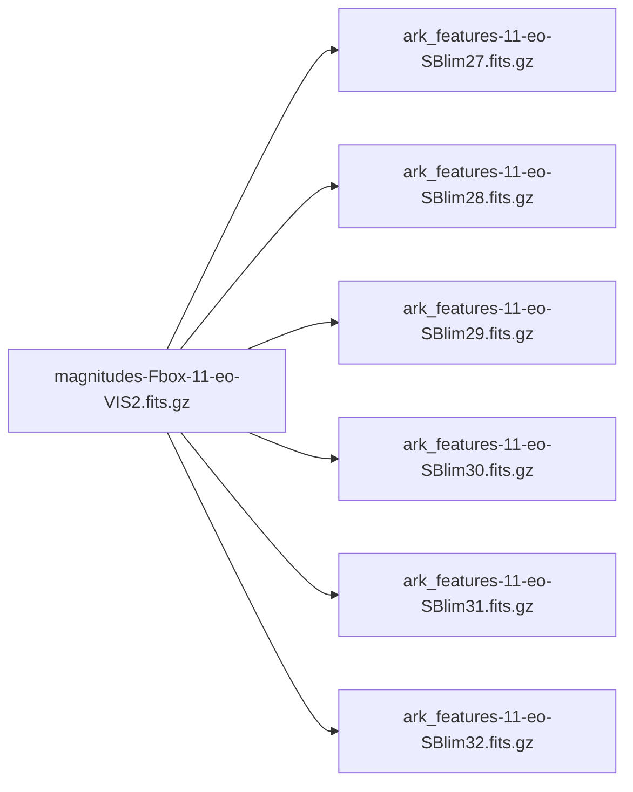

# FIREbox-DR1 Dataset Analysis for SAM3 Training

## Overview

The **FIREbox-DR1** dataset, created by Pascale Jablonka, contains surface brightness maps and corresponding Low Surface Brightness (LSB) feature masks from the FIREbox simulation. This analysis documents the dataset structure and provides guidance on preparing it for SAM3 training.

> [!IMPORTANT]
> This data is restricted to ARRAKIHS consortium members only. Any publication requires approval from the FIRE collaboration.

---

## Dataset Location

```
/home/yuqyan/Yuqi/scripts/LSB_and_Satellites/FIREbox-DR1/
```

---

## Dataset Structure

```
FIREbox-DR1/
├── ReadMe.md              # Original documentation
├── SB_maps/               # VIS2 surface brightness maps (used for detection)
│   └── magnitudes-Fbox-{ID}-{proj}-VIS2.fits.gz
├── SB_mapsv4/             # Multi-band maps (VIS1, VIS2, NIR2)
│   ├── VIS1v4_EO/        # 66 files
│   ├── VIS1v4_FO/        # 66 files
│   ├── VIS2v4_EO/        # 66 files
│   ├── VIS2v4_FO/        # 66 files
│   ├── NIR2v4_EO/        # 66 files
│   └── NIR2v4_FO/        # 66 files
├── MASKS_EO/              # Instance segmentation masks (edge-on projection)
│   └── ark_features-{ID}-eo-SBlim{value}.fits.gz  (396 files)
├── MASKS_FO/              # Instance segmentation masks (face-on projection)
│   └── ark_features-{ID}-fo-SBlim{value}.fits.gz  (410 files)
├── TABLES/               
│   ├── workfile_eo        # Feature properties table (edge-on)
│   └── workfile_fo        # Feature properties table (face-on)
├── FIGURES/               # Visualization examples
│   ├── FIGURES_EO/
│   └── FIGURES_FO/
└── Analysis/              # Additional analysis files
```

---

## Key Dataset Properties

### Surface Brightness Maps

| Property             | Value                                         |
| -------------------- | --------------------------------------------- |
| **Image Dimensions** | 1072 × 1072 pixels                            |
| **Data Type**        | float32                                       |
| **Units**            | mag/arcsec²                                   |
| **Value Range**      | ~18.86 to 100.0 (100 = no detection/infinity) |
| **Distance**         | 35 Mpc (assumed)                              |

### Galaxies Covered

The dataset uses **FIREbox Halo IDs** (e.g., 11, 13, 19). These correspond to specific galaxies in the simulation.

| Property                | Value                                     |
| ----------------------- | ----------------------------------------- |
| **Unique Galaxy IDs**   | 35 galaxies in SB_maps, 66 in SB_mapsv4   |
| **Projections**         | 2 per galaxy (eo = edge-on, fo = face-on) |
| **Total Source Images** | 70 (SB_maps) / 396 (SB_mapsv4 per band)   |

**Galaxy IDs in SB_maps:**
```
11, 13, 19, 22, 24, 25, 27, 28, 29, 30, 32, 33, 34, 35, 36, 37, 38, 39, 
41, 42, 43, 44, 45, 46, 47, 48, 49, 50, 53, 56, 62, 63, 64, 66, 68
```

> [!NOTE]
> **Galaxy ID Mapping**: The IDs used in filenames (e.g., `11`) are **FIREbox Halo IDs**. 
> - The mapping to **ARRAKIHS IDs** (0, 1, 2...) is found in:  
>   `/home/yuqyan/Yuqi/Lucas_data/ARRAKIHS_FIREbox_catalogue/FIREbox_haloID.csv`
> - **Example**: ARRAKIHS ID `0` ↔ FIREbox Halo ID `11`
> - Physical properties (Mass, etc.) can be found in `Catalogue.pdf` in the same directory.

### Mask Properties

| Property            | Value                                                            |
| ------------------- | ---------------------------------------------------------------- |
| **Mask Dimensions** | 1072 × 1072 pixels (matches source images)                       |
| **Data Type**       | float64                                                          |
| **Values**          | 0 = background, 1+ = instance IDs                                |
| **SB Thresholds**   | 27, 27.5, 28, 28.5, 29, 29.5, 30, 30.5, 31, 31.5, 32 mag/arcsec² |

---

## Image-to-Mask Correspondence

### Naming Convention

| File Type        | Pattern                                                         |
| ---------------- | --------------------------------------------------------------- |
| **Source Image** | `magnitudes-Fbox-{GalaxyID}-{projection}-VIS2.fits.gz`          |
| **Mask**         | `ark_features-{GalaxyID}-{projection}-SBlim{threshold}.fits.gz` |

### Example Mapping

For **Galaxy 11** with **edge-on (eo) projection**:



**One source image → 11 masks** (one per SB threshold)

---

### Mask Instance Analysis

The masks are **instance-segmented** — each detected LSB feature has a unique integer ID:

> [!IMPORTANT]
> **Where are the Instance IDs saved?**
> 1. **In the Mask Files**: The IDs are stored **directly as pixel values** in the FITS files.
>    - Pixel value `0`: Background
>    - Pixel value `1`: Feature Instance 1
>    - Pixel value `2`: Feature Instance 2
> 2. **In the Tables**: The `TABLES/workfile_eo` (and `_fo`) files list properties for each ID.
>    - `feat_id` "id1" corresponds to **Pixel Value 1**
>    - `feat_id` "id2" corresponds to **Pixel Value 2**
>
> **Are there "Real Names" (e.g., "Stream", "Shell")?**
> **No.** The dataset does **not** provide semantic classifications or "real names" for the features.
> - The IDs (`id1`, `id2`...) are purely **algorithmic detections** based on the surface brightness threshold.
> - `id1` just means "The 1st feature detected by the algorithm".
> - You have physical properties (Area, SB, Distance) in the tables, but no morphological labels.

#### Example Verification (Galaxy 11, SBlim 30)

| Feature | Mask Pixel Value | Pixel Count (from Mask) | Area in Table (`workfile_eo`) |
| ------- | ---------------- | ----------------------- | ----------------------------- |
| `id1`   | **1**            | 1,009                   | 1,009                         |
| `id2`   | **2**            | 10,253                  | 10,253                        |
| `id3`   | **3**            | 3,869                   | 3,869                         |

| SB Threshold | Features Detected (Galaxy 11, eo) | Labeled Pixels |
| ------------ | --------------------------------- | -------------- |
| 27           | 0 features                        | 0              |
| 28           | 1 feature (id1)                   | 1,009          |
| 29           | 2 features (id1, id2)             | 7,278          |
| 30           | 3 features (id1, id2, id3)        | 15,131         |
| 31           | 8 features                        | 22,154         |
| 32           | 14 features                       | 46,439         |

> [!TIP]
> Lower SB thresholds (27-28) detect only the brightest features, while higher thresholds (31-32) reveal more diffuse structures.

---

## TABLES Data (Feature Properties)

The `workfile_eo` and `workfile_fo` files contain feature properties:

| Column        | Description                            |
| ------------- | -------------------------------------- |
| `haloid`      | Galaxy/halo ID                         |
| `SB_limit`    | Surface brightness threshold           |
| `feat_id`     | Feature identifier (id1, id2, ...)     |
| `<SB_feat>`   | Mean surface brightness of the feature |
| `area_feat`   | Area in pixels                         |
| `median_dist` | Median distance from center (kpc)      |

---

## Preparing Data for SAM3 Training

### Option 1: Single-Threshold Approach
Select one SB threshold and use it consistently:

```python
# Example: Use SBlim 30 for all training
image = "SB_maps/magnitudes-Fbox-{id}-{proj}-VIS2.fits.gz"
mask = "MASKS_{PROJ}/ark_features-{id}-{proj}-SBlim30.fits.gz"
```

### Option 2: Multi-Threshold Approach
Treat each SB threshold as a different "concept" for SAM3:

```python
# Training samples per image
for threshold in ['27', '28', '29', '30', '31', '32']:
    image = source_image
    mask = f"ark_features-{id}-{proj}-SBlim{threshold}.fits.gz"
    concept = f"LSB features at {threshold} mag/arcsec²"
```

### Option 3: Multi-Band Input
Use SB_mapsv4 for multi-channel input (VIS1, VIS2, NIR2):

```python
# Stack 3 bands as RGB-like input
vis1 = fits.open(f"SB_mapsv4/VIS1v4_{proj}/{image_name}")
vis2 = fits.open(f"SB_mapsv4/VIS2v4_{proj}/{image_name}")
nir2 = fits.open(f"SB_mapsv4/NIR2v4_{proj}/{image_name}")
```

---

## Data Preprocessing Recommendations

1. **Normalize SB values**: Convert from mag/arcsec² to a 0-1 range suitable for neural networks

2. **Handle infinity**: Replace 100.0 values (no detection) with appropriate values

3. **Convert masks to binary or instance format**: SAM3 expects specific mask formats

4. **Match image/mask dimensions**: Already 1072×1072 — may need resizing for model input

---

## Summary Statistics

| Metric                                     | Value                        |
| ------------------------------------------ | ---------------------------- |
| Total source images (SB_maps)              | 70                           |
| Total source images (SB_mapsv4, all bands) | 396                          |
| Total masks (EO + FO)                      | 806                          |
| Image-mask pairs at SBlim 30               | 70                           |
| Unique galaxies                            | 35 (SB_maps), 66 (SB_mapsv4) |
| Image resolution                           | 1072 × 1072                  |
| SB threshold options                       | 11 values                    |

---

## Files Reference

- **Source README**: [ReadMe.md](file:///home/yuqyan/Yuqi/scripts/LSB_and_Satellites/FIREbox-DR1/ReadMe.md)
- **Galaxy ID Mapping**: [FIREbox_haloID.csv](file:///home/yuqyan/Yuqi/Lucas_data/ARRAKIHS_FIREbox_catalogue/FIREbox_haloID.csv) (Maps ARRAKIHS ID ↔ FIREbox Halo ID)
- **Galaxy Catalog**: [Catalogue.pdf](file:///home/yuqyan/Yuqi/Lucas_data/ARRAKIHS_FIREbox_catalogue/Catalogue.pdf) (Contains physical properties)
- **SAM3 README**: [README.md](file:///home/yuqyan/Yuqi/sam3/README.md)
- **SAM3 Training Guide**: [README_TRAIN.md](file:///home/yuqyan/Yuqi/sam3/README_TRAIN.md)
